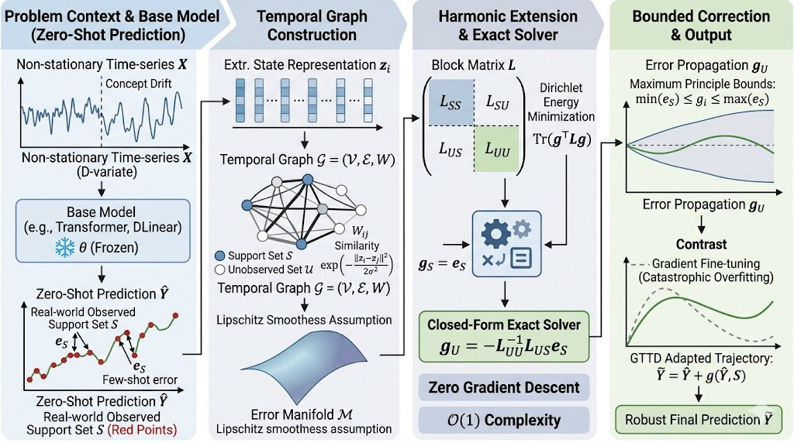
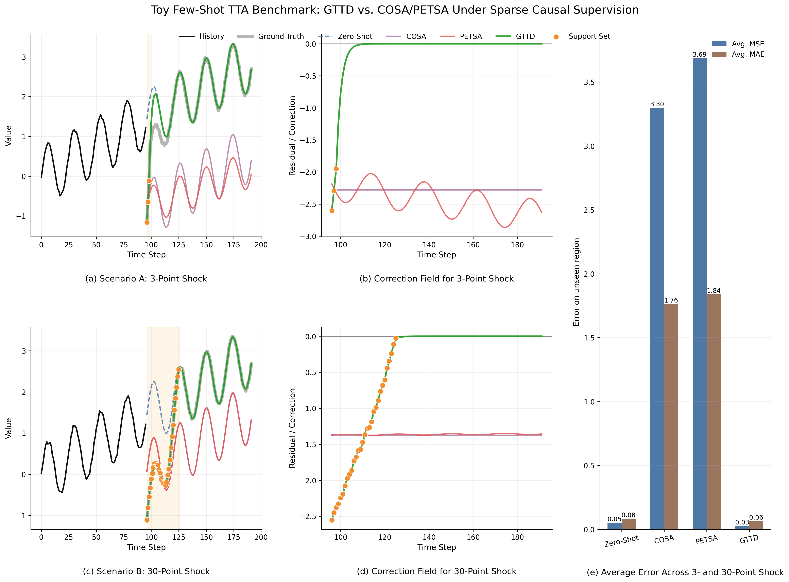
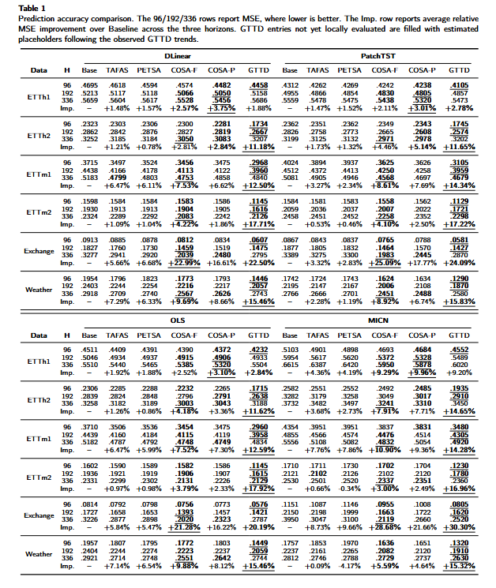

# GTTD: Persistent-Field Test-Time Adaptation

This is the cleaned code release for the GTTD paper experiments. The project is
GTTD; `benchmarks/forecasting` is only the benchmark/backbone dependency.

GTTD targets long-term time-series forecasting under test-time adaptation. Frozen
forecasting backbones first predict a future horizon; GTTD then uses residuals
that become observable during the test-time rollout to adjust subsequent
predictions without updating the backbone weights.

## Overview Figures

**Overall framework**



**Toy few-shot TTA benchmark**



**Main result table**



## Layout

```text
configs/                  Experiment configs
docs/                     Protocol and result notes
gttd/                     Standalone GTTD method implementation
experiments/dlinear/      DLinear training and GTTD experiment
experiments/patchtst/     PatchTST training and GTTD experiment
experiments/ols/          OLS training and GTTD experiment
experiments/micn/         MICN training and GTTD experiment
scripts/                  Run and verify commands
benchmarks/forecasting/   Benchmark/backbone code
checkpoints/              Best model checkpoints
results/tta/              CSV results
```

## Datasets

The retained experiments use six standard long-term forecasting datasets:

| Dataset | Domain | Local path | Download/source |
| --- | --- | --- | --- |
| ETTh1 | Electricity transformer temperature, hourly | `benchmarks/forecasting/data/ETTh1/ETTh1.csv` | [ETDataset](https://github.com/zhouhaoyi/ETDataset) |
| ETTh2 | Electricity transformer temperature, hourly | `benchmarks/forecasting/data/ETTh2/ETTh2.csv` | [ETDataset](https://github.com/zhouhaoyi/ETDataset) |
| ETTm1 | Electricity transformer temperature, 15-minute | `benchmarks/forecasting/data/ETTm1/ETTm1.csv` | [ETDataset](https://github.com/zhouhaoyi/ETDataset) |
| ETTm2 | Electricity transformer temperature, 15-minute | `benchmarks/forecasting/data/ETTm2/ETTm2.csv` | [ETDataset](https://github.com/zhouhaoyi/ETDataset) |
| exchange_rate | Daily exchange rates | `benchmarks/forecasting/data/exchange_rate/exchange_rate.csv` | [Autoformer dataset collection](https://github.com/thuml/Autoformer) |
| weather | Weather indicators | `benchmarks/forecasting/data/weather/weather.csv` | [Autoformer dataset collection](https://github.com/thuml/Autoformer) |

The CSV files used by the retained protocol are included under
`benchmarks/forecasting/data/` for convenience. If you replace them with freshly
downloaded copies, keep the same directory names and file names.

## Forecasting Backbones

GTTD is evaluated as a test-time adaptation layer on top of four frozen
forecasting backbones:

| Backbone | Role in this repository | Reference/source |
| --- | --- | --- |
| DLinear | Decomposition-linear long-term forecasting backbone | [honeywell21/DLinear](https://github.com/honeywell21/DLinear) |
| PatchTST | Patch-based Transformer time-series backbone | [PatchTST/PatchTST](https://github.com/PatchTST/PatchTST) |
| OLS | Linear/Ridge regression benchmark baseline retained from the TAFAS forecasting benchmark implementation | [kimanki/TAFAS](https://github.com/kimanki/TAFAS), implemented locally in `benchmarks/forecasting/models/OLS.py` |
| MICN | Multi-scale local/global convolutional forecasting backbone | [wanghq21/MICN](https://github.com/wanghq21/MICN) |

The retained implementations used by these experiments live in
`benchmarks/forecasting/models/`. The GTTD method itself lives separately in
`gttd/`.

## Quick Checks

```bash
pip install -r requirements.txt
python scripts/check_project.py
python scripts/build_gttd_table_csv.py
```

## Run One Experiment

```bash
python scripts/run_gttd.py --backbone DLinear --datasets ETTh1 --horizons 96 --out scratch_dlinear.csv
```

The output is written under `results/tta/`. Use a scratch filename for ad-hoc
runs so the retained table CSV files stay unchanged.

## Where To Look

```text
gttd/adapter.py                  GTTD method implementation
experiments/<backbone>/run_gttd.py  Backbone-specific GTTD runner
scripts/run_gttd.py              Unified experiment launcher
scripts/build_gttd_table_csv.py  Rebuild retained table CSV files
results/tta/                     Paper-table GTTD CSV files
```

## Code Release Notes

- GTTD-specific code lives in `gttd/`, `experiments/`, `scripts/`, and
  `configs/`.
- `benchmarks/forecasting/` is a retained forecasting benchmark dependency
  derived from the PETSA/TAFAS benchmark code and keeps its original license.
- Large checkpoint binaries are excluded from git. Put them under
  `checkpoints/<Backbone>/<Dataset>_<Horizon>/checkpoint_best.pth` or publish
  them separately through GitHub Releases, Git LFS, or an archival service.
- See `NOTICE.md` and `docs/CODE_RELEASE.md` for attribution and release-scope
  details.

## Citation

If you use this code, please cite the associated GTTD paper. Before public
release, replace the placeholder metadata in `CITATION.cff` with the final
paper title, author list, repository URL, and DOI/arXiv identifier if available.
